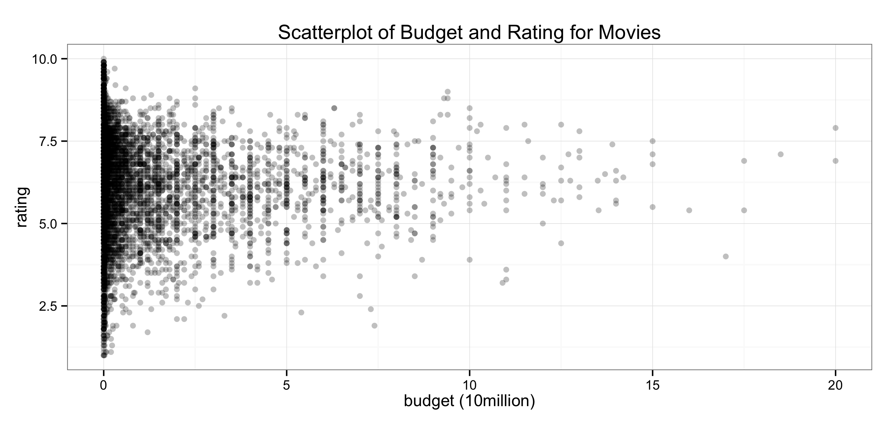
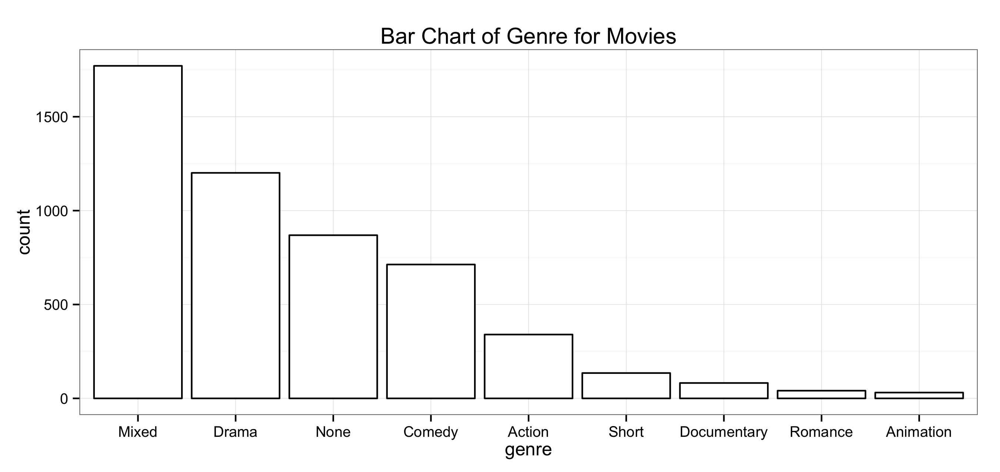
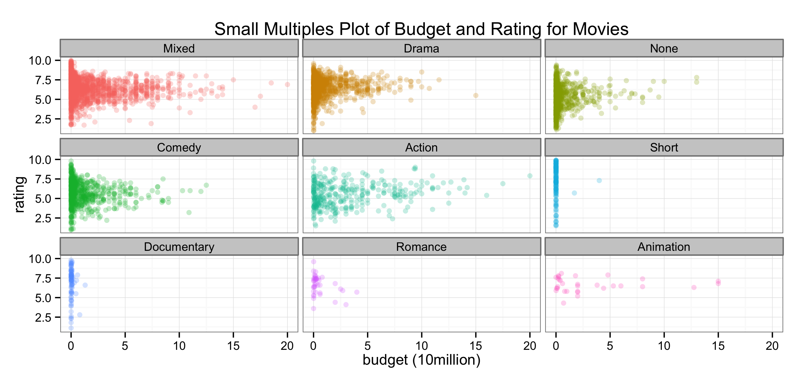
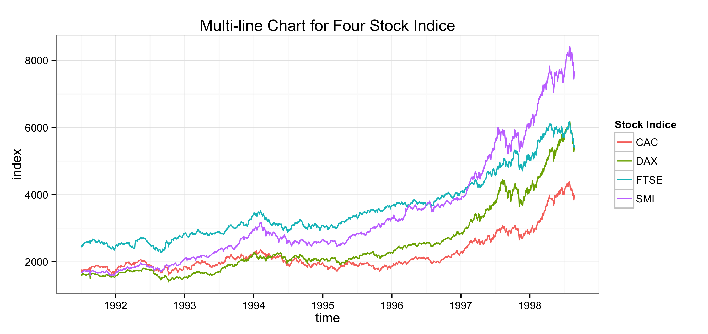

Homework 1: Basic Charts
========================================================

| **Name**  | Lee Cai |
|----------:|:-------------|
| **Email** | lcai11@dons.usfca.edu |

## Instructions

The following packages must be installed prior to running this code:
* ggplot2
* devtools
* plyr

To run this code, please enter the following commands in R:
```
library(devtools)
source_url("https://raw.github.com/cadancai/msan622/homework0/homework1.R")
```

This will generate 4 images. See below for details.

## Discussion


### Scatter Plot
The first plot is a scatter plot with x axis as budget and y axis as rating of the movies. I used alpha in the geom_bar() function to control the level of transparency for each point on the graph, so that the density of the points on the graph can be sensed. I also set the scale on the x axis to be in 10 millions.



### Bar Chart
The second plot is a bar chart showing the counts of movies in each genre. The order of the bars is set to be decreasing by the counts. In this way the order of the counts will be captured by viewers immediately.



### Small Multiples Chart
The third plot is a small multiple chart, which consists of nine small plots. Each small plot is a scatter plot of budget and rating for one of the nine genres of movies. Again the transparency option is used to show the density of the points on each plot. The use of the color make the plots less boring, but may not add much additional information.



### Multiline Plot
The last plot is a multi-line chart, which put four time series of four distinctive stock indice on the same panel. It is good for comparing the trend of the four time series and their magnitude will also stand out as we look at the chart.



For all four plots, I use the black and white theme, the simplicity of which makes the plots stand out more.
